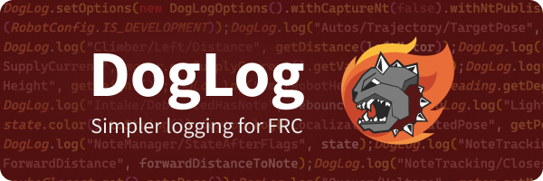

# DogLog



DogLog is a logging library for FRC teams, created for use on [Team 581](https://github.com/team581).

See [**the documentation site**](https://doglog.dev) for more information.

## Installation

**Please see the [installation guide](https://doglog.dev/getting-started/installation/) for more information.**

### Vendordep URL

```text
https://doglog.dev/vendordep.json
```

## Usage

**Please see the [usage guide](https://doglog.dev/getting-started/usage/) for more information.**

First, import the library from the dev.doglog namespace:

```java
import dev.doglog.DogLog;
```

And then you can use Doglog.log() to log values like so:

```java
DogLog.log("Arm/Position", motor.getPosition().getValue());
```

You can include these log statements in your periodic methods, or anywhere else you want to log data.

## Project goals

- Get started in seconds
  - Add the vendordep and start logging, no configuration or setup boilerplate needed
- Performance where it counts
  - DogLog was designed for fast logging, powered by WPILib's highly optimized `DataLogManager` API
- Configurable to the core
  - Customize practically all logger behavior with a simple, yet powerful, configuration API
- Log with confidence
  - DogLog was created to address the lack of a safe and fault-tolerant logging solution for FRC, without sacrificing developer experience
