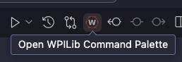
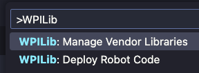

# DogLog

DogLog is a logging library for FRC teams, created for use on [Team 581](https://github.com/team581).

## Usage

Once installed, getting started with DogLog is super easy:

### Logging

You can use `Doglog.log()` to log values like so:

```java
DogLog.log("Arm/Position", motor.getPosition().getValue());
```

You can include these log statements in your periodic methods, or anywhere else you want to log data.

### Configuring

DogLog comes with a safe, reasonable default configuration out of the box, but most users will want to customize it to their needs.

You can set DogLog's options like so:

1. Import the library at the top of `Robot.java`/`RobotContainer.java`:

   ```java
    import dev.doglog.DogLog;
    import dev.doglog.DogLogOptions;
    import edu.wpi.first.wpilibj.DriverStation;
   ```

2. In your `Robot`/`RobotContainer` constructor, add the following lines:

   ```java
    DogLog.setOptions(new DogLogOptions().withNtPublish(!DriverStation.isFMSAttached()));
   ```

   This configures DogLog to use the default options as a base, and extends them to publish logged fields to NetworkTables when your robot isn't connected to the FMS.

   > [!TIP]
   > Logging to NetworkTables causes major connection issues if you are using a competition flashed radio with bandwidth limits

## Installation

DogLog is best installed as a vendor dependency (vendordep).
You can read more about vendordeps on [the WPILib docs](https://docs.wpilib.org/en/stable/docs/software/vscode-overview/3rd-party-libraries.html#installing-libraries).

### Vendordep URL

```text
https://raw.githubusercontent.com/jonahsnider/doglog/main/vendordep.json
```

### Detailed instructions

1. Open the WPILib command palette
   
2. Select "Manage Vendor Libraries"
   
3. Select "Install new libraries (online)"
   
4. Paste the vendordep URL from the codeblock above
   
5. Press <kbd>Enter</kbd> to finish adding the vendordep

Once the vendordep has been added, you can run a build to complete the install.

You may need to restart your editor for DogLog to be available in editor suggestions.
