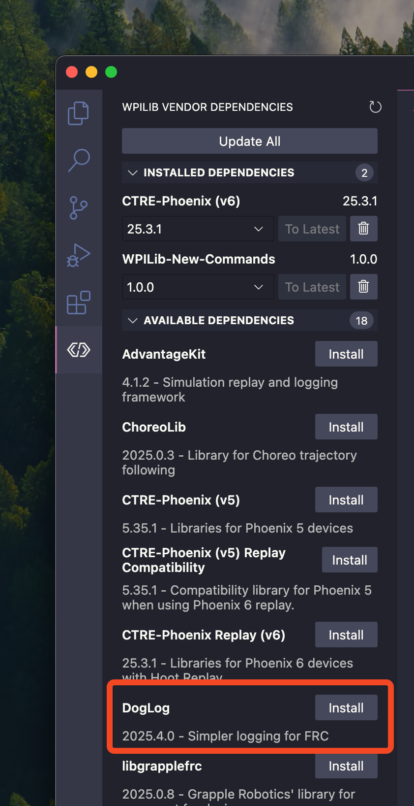
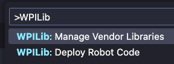
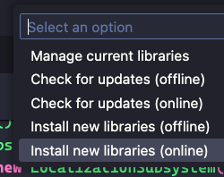
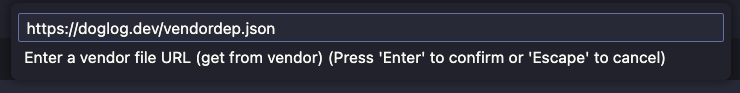

import { Steps, Tabs, TabItem } from '@astrojs/starlight/components';

DogLog can be added to projects by installing it as a vendor dependency (vendordep).
You can read more about vendordeps on [the WPILib docs](https://docs.wpilib.org/en/stable/docs/software/vscode-overview/3rd-party-libraries.html#installing-libraries).

DogLog can be added using the WPILib VS Code extension, or by manually entering the vendordep URL.

<Tabs>
	<TabItem label="WPILib VS Code extension">

<Steps>

1. Select thet "WPILib Vendor Dependencies" extension from the VS Code sidebar
2. Find "DogLog" under the "Available Dependencies" section
   
3. Click "Install"
4. Once the vendordep has been added, you can run a build to complete the install.

</Steps>

</TabItem>

    <TabItem label="Vendordep URL">

<Steps>

1. Open the WPILib command palette
   
2. Select "Manage Vendor Libraries"
   
3. Select "Install new libraries (online)"
   
4. Paste the `https://doglog.dev/vendordep.json` URL into the dialog
   
5. Press <kbd>Enter</kbd> to finish adding the vendordep
6. Once the vendordep has been added, you can run a build to complete the install.

</Steps>

:::note
You may need to restart your editor before DogLog is available in editor suggestions.
:::

  </TabItem>

</Tabs>
