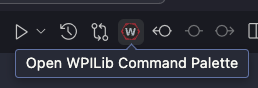
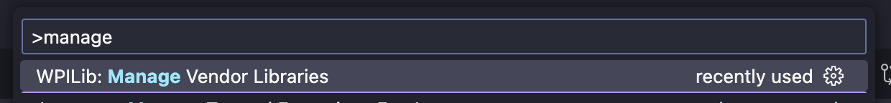
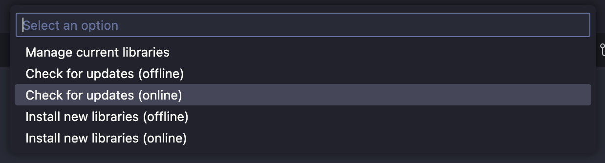
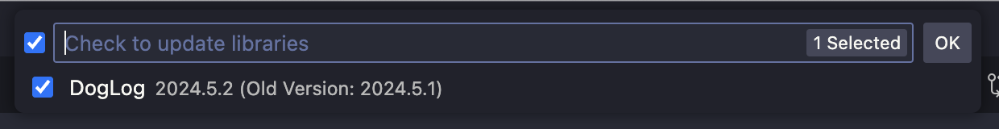
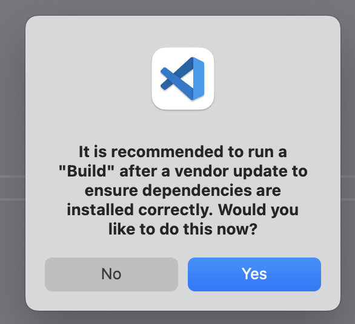

import { Steps } from '@astrojs/starlight/components';

DogLog periodically has new versions released.
This guide walks through the steps of updating the DogLog vendordep to the latest version.

## Steps

<Steps>

1. Open the WPILib command palette
   
2. Select "Manage Vendor Libraries"
   
3. Select "Check for updates (online)"
   
4. If an update is available, select "DogLog" from the list of available vendordep updates
   
5. Click "OK" or hit <kbd>Enter</kbd> to update the selected vendordeps
6. After updating, you can click "Yes" to run a build and ensure that the update was successful
   

</Steps>

## Changelog

Each time an update is released, it will have an entry added to [the changelog page](/reference/changelog).
